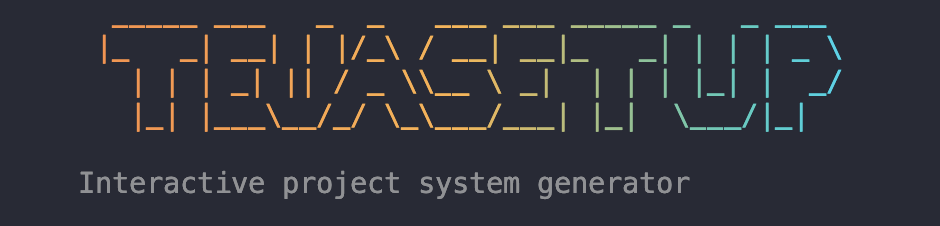
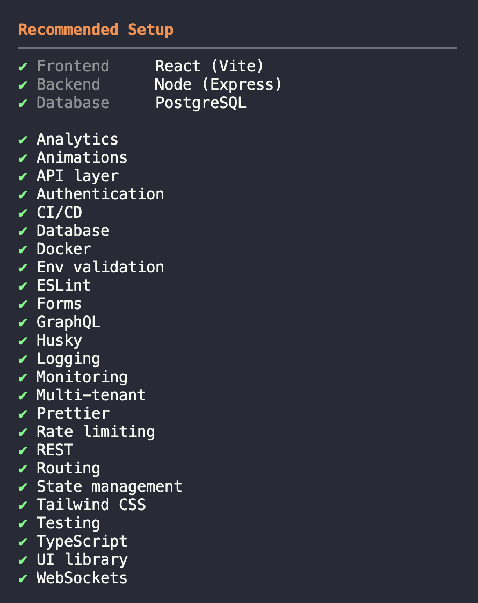
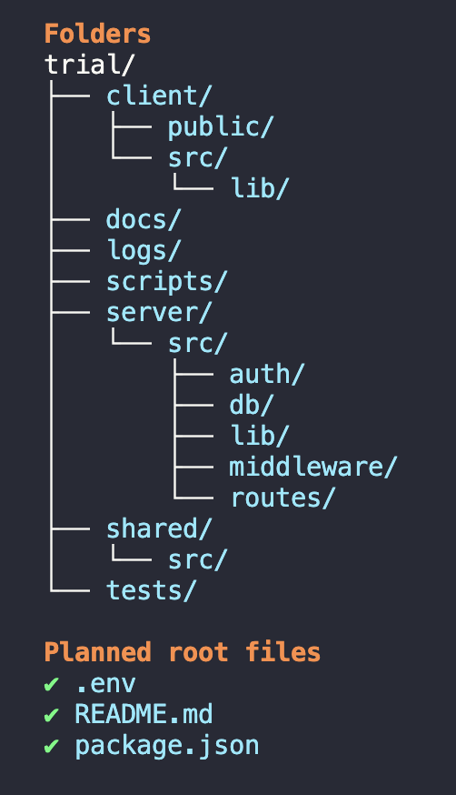
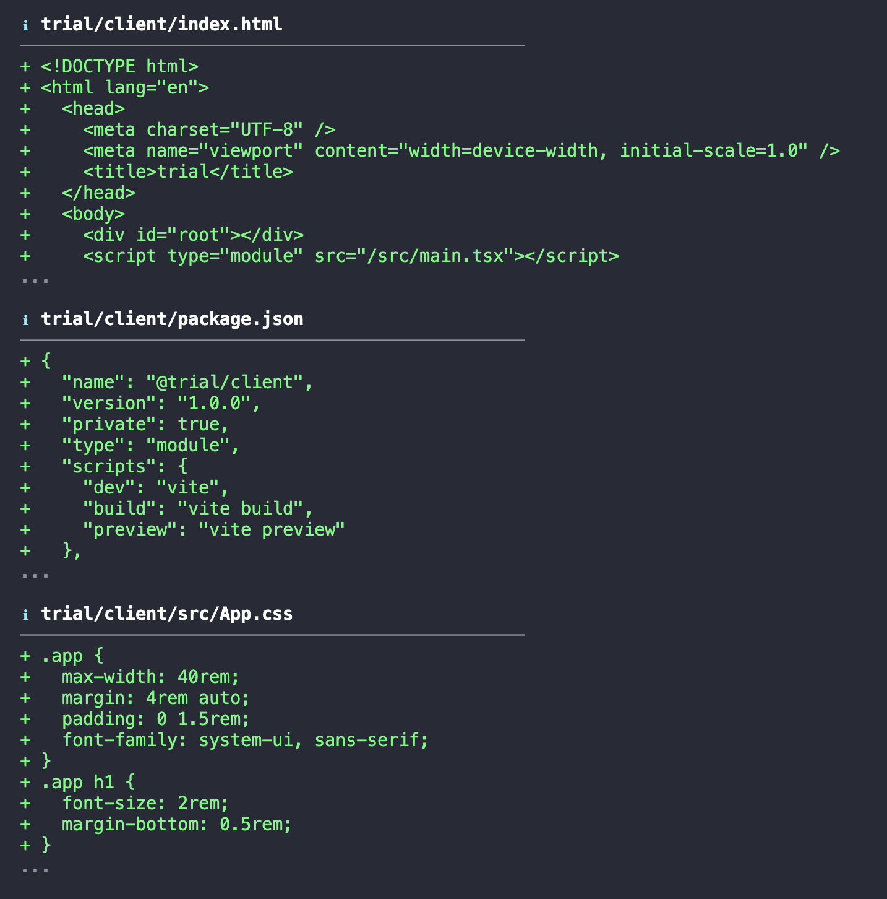

<div align="center">



Scaffold **web**, **API**, **full-stack**, and **Node CLI** workspaces with npm workspaces, React (Vite), Express, shared code, and optional auth / database / logging stubs.

<br/>

</div>

---

## Requirements

- **Node.js 20+**
- **npm** (for generated projects and optional `git init` / `npm install` steps)

## Install

```bash
npm install -g tejasetup
```

Or run from a clone:

```bash
cd tejasetup
npm install
npm link   # optional: global `tejasetup` command
```

## Screenshots

### Blueprint & recommended setup

After you pick a project type, mode, and features, the CLI shows a **Recommended Setup** summary — stack, data tier hints, and the feature set so you can accept suggestions or continue with your own choices.



### Structure & planned files

Before generation, review the **folder tree** and **planned root files** (for example `package.json`, `.env`, `README.md`) so you know exactly what will be created.



### File preview (diff-style)

See a **preview of generated files** (here: Vite client entry, `package.json`, styles) similar to a patch view, then confirm when you are ready to write to disk.



## Usage

```bash
# Interactive create (default when no subcommand)
tejasetup
tejasetup init

# Add a scaffold feature to an existing generated project
tejasetup add auth
tejasetup add database
tejasetup add logging

# Environment / manifest check
tejasetup doctor
```

Use `-C <path>` with `add` or `doctor` to point at a project directory.

## Generated output

- **Stacks**: React (Vite) client, Node (Express) API, Node CLI layout, and `shared/` — depending on what you pick.
- **Features**: The CLI records choices in `.tejasetup/manifest.json`. Auth / database / logging add **starter** server and client files, not production auth.

### Security

Replace demo values before production:

- **`JWT_SECRET`** and any secrets in `.env`
- Auth routes are **demos** (e.g. JWT sign without real user storage unless you wire a database)

## `tejasetup add` and your stack

`add` applies the same **dependency and stack rules** as `init` (non-interactively): for example, enabling auth can auto-enable **database** where the rules require it; options that need Express are dropped if your manifest has no API server. If a feature cannot apply to your stack, the command warns you and **does not** change the manifest.

## Project types vs templates

Many project **types** (Electron, React Native, extension, etc.) mainly adjust **folder placeholders**. The richest templates today are **web**, **API**, **full-stack**, **CLI**, and **library-style** layouts.

## License

MIT — see [LICENSE](./LICENSE).

## Repository

If `package.json` `repository` / `bugs` / `homepage` do not match your fork, update them before publishing.
